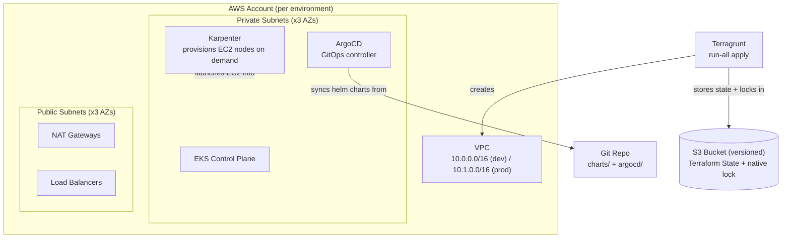
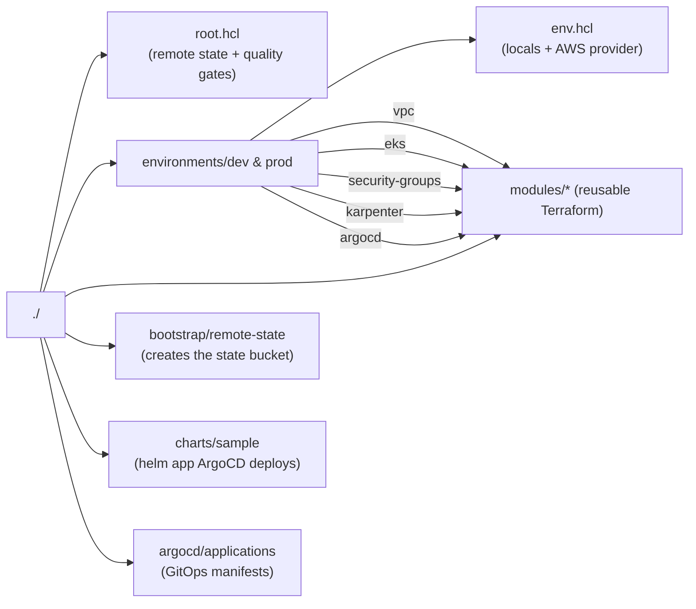
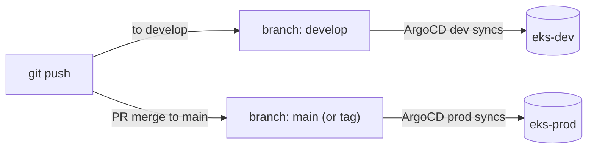
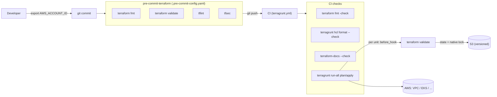
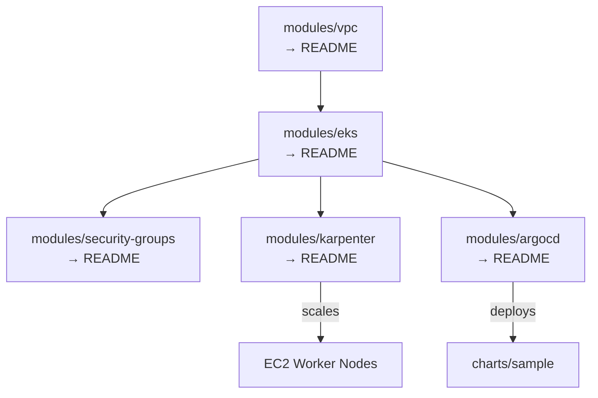

# EKS Platform (Terraform + Terragrunt)

Production-style **Amazon EKS** platform defined in Terraform and orchestrated by
Terragrunt across `dev` and `prod`, isolated in separate AWS accounts / VPCs.

---

## What you are looking at (big picture)



---

## Prerequisites

| Tool | Why | Install |
|------|-----|---------|
| `aws` CLI | authenticate to AWS | `brew install awscli` |
| `terraform` | describe infrastructure | `brew install terraform` |
| `terragrunt` | DRY orchestration | `brew install terragrunt` |
| `kubectl` | talk to the cluster | `brew install kubectl` |
| `helm` | package Kubernetes apps | `brew install helm` |

Authenticate with AWS (SSO or a profile) so Terragrunt can assume the
environment's IAM role.

---

## Directory layout



- **`modules/`** — reusable Terraform "blueprints". They know *how* to build
  something (e.g. a VPC) but not *where* or *with what names* — those come from
  the environment.
- **`environments/<env>/<unit>/terragrunt.hcl`** — the "wiring". Each file merges
  two flat partials via named includes — `root.hcl` (remote state + quality gates)
  and `<env>/env.hcl` (`expose = true`, so the env's `locals` are referenceable) —
  then points at a module (`source`) and supplies the inputs plus the dependencies
  between units. Terragrunt allows only one level of includes, so the two partials
  never include each other; only leaf units hold `include` blocks.
- **`root.hcl` + `environments/<env>/env.hcl`** — the two shared partials:
  `root.hcl` holds account-global blocks (S3 remote state with native locking) and
  `env.hcl` holds the per-environment values (CIDRs, cluster version, git branch)
  plus this environment's AWS provider (`generate`).
- **`bootstrap/remote-state`** — a one-time stack that creates the **versioned
  S3 bucket** (with native state locking) that every other stack stores its state
  in. No DynamoDB table is created.

---

## How to deploy (step by step)

### 0. One-time: create the state backend

Creates the versioned S3 bucket (state + native locking) all other stacks use.
Run once per AWS account (local backend, self-contained):

```bash
# The account id is injected via env var (never hardcoded in the file):
export AWS_ACCOUNT_ID=<your-nonprod-account-id>
terragrunt apply --terragrunt-working-dir bootstrap/remote-state
```

> `bootstrap/remote-state/terragrunt.hcl` reads `AWS_ACCOUNT_ID` via `get_env`;
> the created bucket `eks-tf-state-${AWS_ACCOUNT_ID}` matches the environments'
> `remote_state` bucket.

### 1. Deploy an environment

Apply all units in dependency order:

```bash
# Plan first (safe, shows what will change)
terragrunt run-all plan  --terragrunt-working-dir environments/dev

# Apply when you are happy
terragrunt run-all apply --terragrunt-working-dir environments/dev
```

Terragrunt automatically orders units using the `dependency` blocks
(`vpc` → `eks` → `security-groups` / `karpenter` / `argocd`).

### 2. Talk to the cluster

```bash
aws eks update-kubeconfig --name eks-dev --region us-east-1
kubectl get nodes          # Karpenter will have launched nodes
kubectl get pods -n argocd # ArgoCD is running
```

### 3. Watch ArgoCD deploy the sample app

ArgoCD reads `argocd/applications/sample-application.yaml` and deploys the Helm
chart in `charts/sample` into the `sample` namespace. Open the ArgoCD UI
(LoadBalancer service in `argocd` namespace) and you will see the `sample` app
sync.

---

## Environments: dev vs prod

| | dev | prod |
|---|-----|------|
| Account (via `AWS_ACCOUNT_ID`) | nonprod account | prod account |
| VPC CIDR | `10.0.0.0/16` | `10.1.0.0/16` |
| API endpoint CIDRs | `0.0.0.0/0` (sandbox) | tighten to VPN (TODO) |
| ArgoCD service | LoadBalancer | tighten to ingress (TODO) |
| Git branch (`git_repo_branch`) | `develop` | `main` |

The two environments are kept in sync by sharing the same modules; only the
`locals` in `environments/<env>/env.hcl` differ (the units reference them via the
exposed `include "env"`). Account IDs and repo URLs are **never committed** — they
come from `AWS_ACCOUNT_ID` / `GIT_REPO_URL` env vars (set in GitHub or exported
locally).

### GitOps promotion model

One repository, differentiated by **revision** (branch/tag) — not by a different
repo URL:



Dev tracks the `develop` branch (fast iteration); prod tracks `main`/a release tag
(immutable promotion). Both point at the same `git_repo_url`.

---

## Things you MUST change before going live

1. **`AWS_ACCOUNT_ID`** — not stored in any file. Set it as a GitHub repo `var`
   (`AWS_ACCOUNT_ID_NONPROD` / `AWS_ACCOUNT_ID_PROD`) and export it locally
   (`export AWS_ACCOUNT_ID=...`) before running bootstrap/terragrunt.
2. **`GIT_REPO_URL`** — set as a GitHub repo `var` (or export locally) so ArgoCD
   points at *your* repo. Dev and prod use the **same** repo, differing by branch.
3. **API endpoint CIDRs** — `0.0.0.0/0` is fine for a sandbox, never for prod.
4. **Karpenter `NodePool` limits** (CPU cap, spot vs on-demand) in
   `modules/karpenter/main.tf`.
5. IAM roles assume the OIDC provider automatically; if CI uses OIDC, wire the
   GitHub Actions role ARNs in `.github/workflows/terragrunt.yml`.

---

## Quality gates (how bad code never reaches AWS)

Every change is checked locally and in CI before it can deploy:



- **Local:** `.pre-commit-config.yaml` runs `terraform fmt`, `terraform validate`,
  `tflint`, and `tfsec` on every commit (install once with `pre-commit install`).
- **CI:** enforces formatting (`terraform fmt -check`, `terragrunt hcl format --check`)
  and docs, then runs `terragrunt run-all plan/apply`.
- **Per unit:** `root.hcl` adds a `before_hook "terraform_validate"`
  so an invalid config fails before a real plan.
- `fmt` / `terraform-docs` are intentionally **not** Terragrunt hooks — those run
  in the cache dir, not your `modules/*` source.

See `AGENTS.md` for the full rule set the AI harness follows.

---

## Module map (where to read next)



Each `modules/<name>/README.md` explains that piece in detail. Start with
[modules/eks/README.md](modules/eks/README.md) if you want to understand the
cluster itself.
