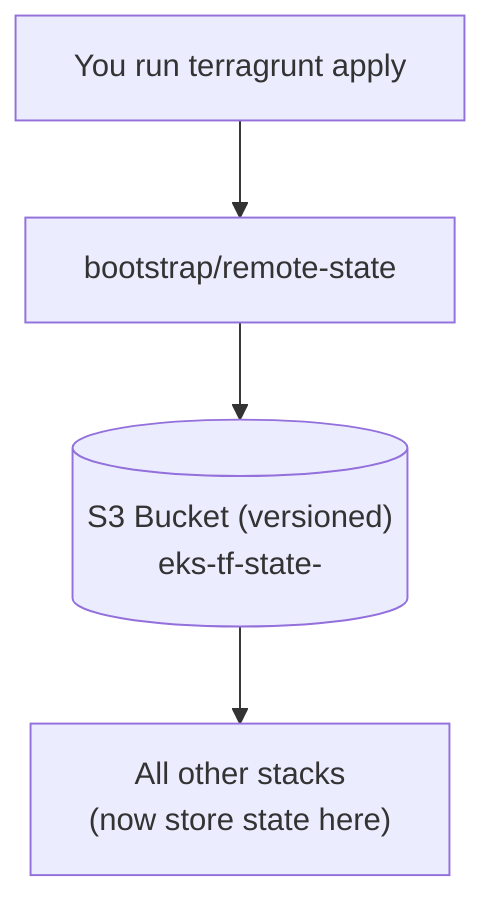

# Bootstrap: `remote-state` — create the Terraform state backend

## Purpose

Terraform must store its **state** (a record of what it created) in a location that
is shared, locked, and durable so teammates and CI can operate safely.

This repository uses an **S3 bucket** with native state locking (S3 conditional
writes, available since Terraform 1.10) — no DynamoDB table is required. Resources
created under `environments/*` write their state there via the `remote_state` block
in the root `terragrunt.hcl`.

There is a chicken-and-egg problem: that `remote_state` block is generated by the
root config, which writes state *into* the very bucket it describes. The bucket must
therefore exist **before** any other stack runs. This bootstrap stack is the
one-time, manual first step. It uses a **local** backend (state on your machine)
so it does not depend on the bucket it is creating.



## What it creates

| Resource | Purpose |
|----------|---------|
| `aws_s3_bucket.state` | Holds `terraform.tfstate` for every unit |
| versioning | Keeps history so you can roll back |
| SSE (AES256) | Encrypts the state at rest |
| public-access-block | Prevents accidental public exposure of secrets in state |
| native locking | S3 conditional writes prevent concurrent applies (no DynamoDB) |

## How to run it (once per AWS account)

1. Export the target account id (injected via `get_env`, never committed):
   `export AWS_ACCOUNT_ID=<account_id>`
2. Authenticate to that account with the AWS CLI.
3. Run:

```bash
terragrunt apply --terragrunt-working-dir bootstrap/remote-state
```

After this succeeds, `terragrunt run-all apply` in `environments/dev` (or `prod`)
will be able to write its state into the bucket.

> This stack is intentionally **standalone** — it does *not* `include` the root
> `terragrunt.hcl`, precisely so it avoids referencing the bucket it creates.
