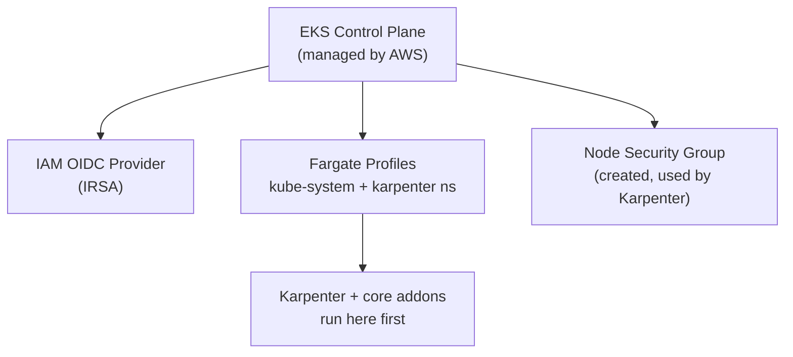
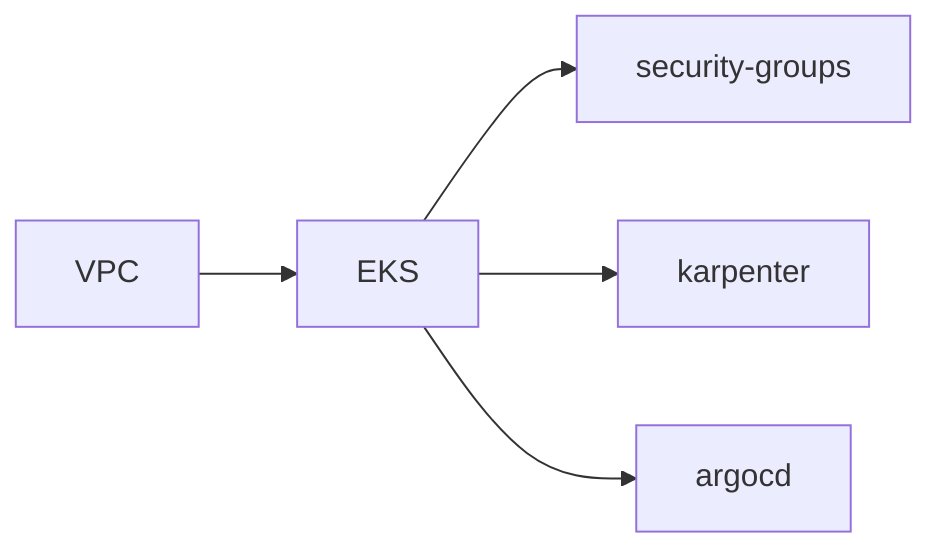

# Module: `eks`

Managed Kubernetes control plane via the official AWS `eks` Terraform module (v20).

## Topology

## Key decisions

| Setting | Value | Why |
|---------|-------|-----|
| `enable_irsa` | `true` | IAM Roles for Service Accounts; exposes `oidc_provider` for Karpenter/ArgoCD |
| `eks_managed_node_groups` | `{}` | no static node groups — Karpenter scales |
| `create_node_security_group` | `true` | SG for nodes Karpenter launches |
| `fargate_profiles` | `kube-system`, `karpenter` | bootstrap Karpenter on Fargate before any EC2 node exists |
| `cluster_endpoint_public_access` | `true` | external `kubectl`; restrict CIDRs in prod |

## IRSA

IRSA lets a Kubernetes Service Account assume an AWS IAM role, so pods get scoped AWS permissions without sharing node credentials. This module enables it and exposes `oidc_provider` / `oidc_provider_arn` for the Karpenter and ArgoCD modules.

## Fargate bootstrap

Karpenter must run before it can launch EC2 nodes. Running Karpenter (and `kube-system` addons) on Fargate — serverless pods needing no EC2 — solves the ordering; once up, Karpenter provisions EC2 capacity for workloads.

## Inputs

| Variable | From |
|----------|------|
| `cluster_name` / `cluster_version` | environment |
| `vpc_id`, `private_subnet_ids`, `public_subnet_ids` | VPC |
| `cluster_endpoint_public_access_cidrs` | environment (tighten in prod) |

## Outputs

- `cluster_endpoint`, `cluster_ca_certificate` — API access.
- `oidc_provider` / `oidc_provider_arn` — IRSA roles.
- `cluster_security_group_id` / `node_security_group_id` — security-groups module.

## Dependency chain

