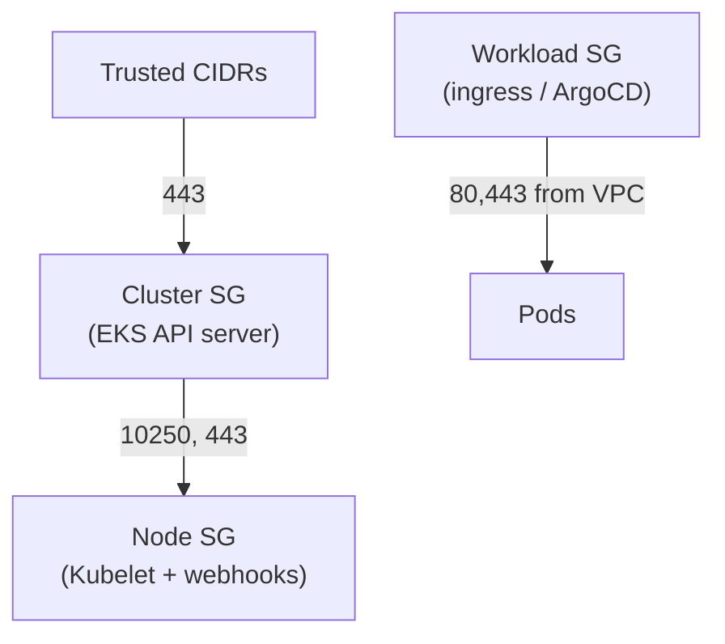
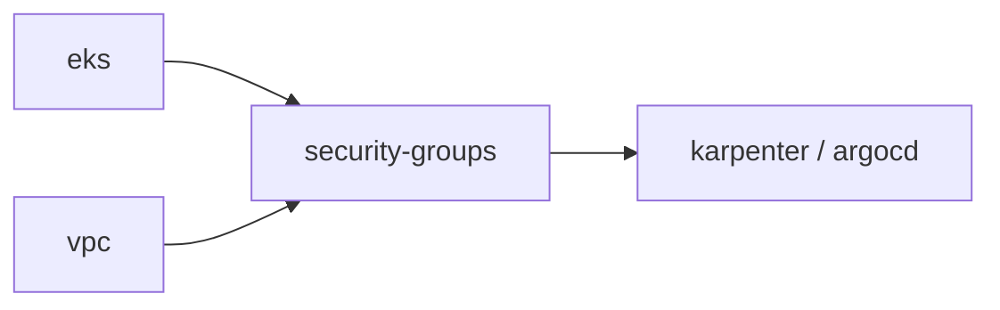

# Module: `security-groups`

Adds ingress/egress rules to the EKS-created control-plane and node security groups and creates a reusable workload SG.

## Rules

1. **API ingress** — HTTPS (443) to the API server from `allowed_api_cidrs`. `0.0.0.0/0` in dev; tighten to corporate CIDRs in prod.
2. **Control-plane → node** — API server → Kubelet (10250) and webhooks (443). Made explicit though EKS usually adds them.
3. **Workload SG** — reusable group for ingress controllers / ArgoCD server; allows HTTP/HTTPS from the VPC and all egress.

Keeping these rules in their own module separates intent (who can talk to what) from the cluster definition.

## Inputs

| Variable | From |
|----------|------|
| `vpc_id` | VPC |
| `cluster_security_group_id` | EKS |
| `node_security_group_id` | EKS |
| `allowed_api_cidrs` | environment |
| `vpc_cidr_block` | VPC |

## Outputs

- `workload_security_group_id` — for ingress controllers / ArgoCD.
- `cluster_security_group_id` / `node_security_group_id` — passed through so dependents don't re-depend on EKS.

## Dependency chain

