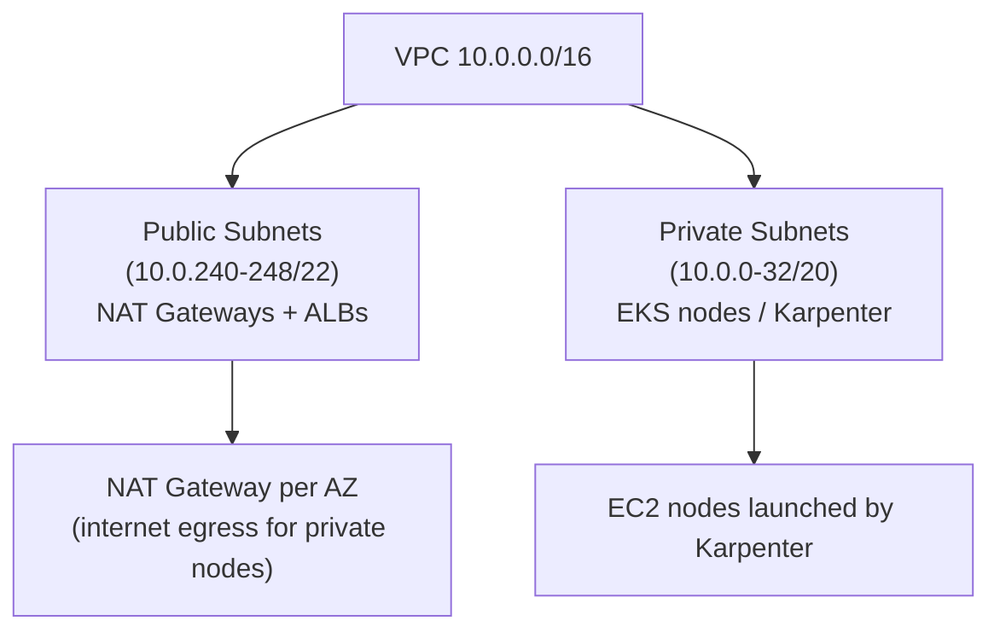
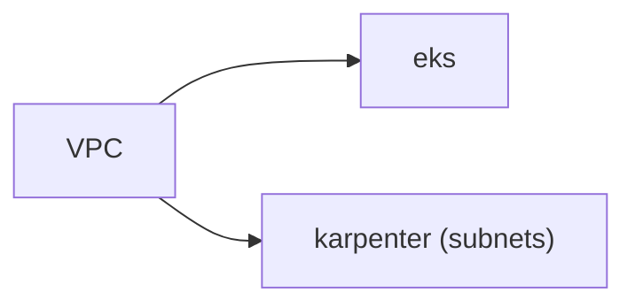

# Module: `vpc`

Wraps [`terraform-aws-modules/vpc/aws`](https://github.com/terraform-aws-modules/terraform-aws-modules/tree/master/modules/vpc) to provide the network all other units live in.

## Topology

- One VPC per environment, `/16` CIDR.
- 3 public subnets (one per AZ) for NAT gateways and internet-facing LBs.
- 3 private subnets for worker nodes (no inbound internet).

## Subnet tags

Kubernetes auto-discovery relies on these:

| Tag | Value | Used by |
|-----|-------|---------|
| `kubernetes.io/role/internal-elb` | `1` | internal ELBs → private subnets |
| `kubernetes.io/role/elb` | `1` | public ELBs → public subnets |
| `karpenter.sh/discovery` | `<cluster-name>` | Karpenter node placement |
| `kubernetes.io/cluster/<name>` | `shared` | EKS VPC membership |

## Inputs

| Variable | Example | Meaning |
|----------|---------|---------|
| `name` | `eks-dev-vpc` | name prefix |
| `cidr` | `10.0.0.0/16` | VPC address range |
| `availability_zones` | 3 AZs | spread for resilience |
| `private_subnet_cidrs` | `/20` blocks | node subnets |
| `public_subnet_cidrs` | `/22` blocks | NAT/LB subnets |
| `cluster_name` | `eks-dev` | discovery tags |

## Outputs

- `vpc_id` — to EKS and security-groups.
- `private_subnets` / `public_subnets` — to EKS (control plane, nodes) and Karpenter (node launch).
- `nat_public_ips` — cluster egress IPs.

## Dependency chain

